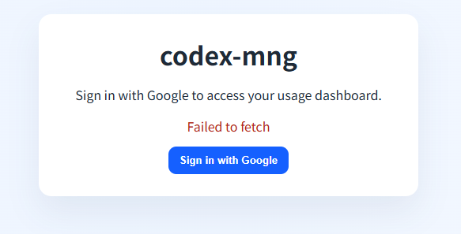
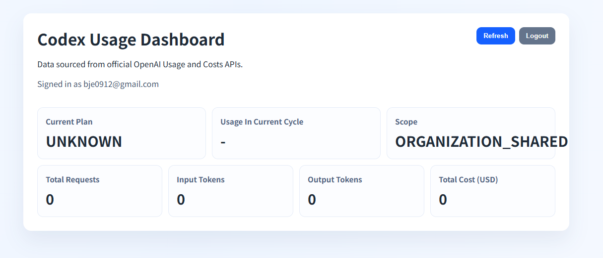

# codex-mng

Google OAuth 로그인 후 OpenAI Usage/Costs API를 조회해 대시보드로 보여주는 프로젝트입니다.

- Backend: Spring Boot 3.0.x (Java 21, Gradle)
- Frontend: Vue 3 + Composition API + Vite
- Backend Port: `8080`
- Frontend Port: `3000`

## 화면 예시

### 1) 로그인 화면


### 2) 대시보드 화면


## 주요 기능

- Google OAuth 로그인
- 로그인 사용자 정보 조회 (`/api/me`)
- Codex/OpenAI usage 대시보드 조회
  - `GET /api/codex/dashboard`
  - `POST /api/codex/dashboard/refresh`
- 세션 기반 인증 + CORS(3000 <-> 8080)

## 프로젝트 구조

```text
codex-mng
├─ src
│  ├─ main
│  │  ├─ java/com/toma/codex
│  │  │  ├─ CodexMngApplication.java
│  │  │  ├─ auth
│  │  │  ├─ usage
│  │  │  └─ api
│  │  └─ resources
│  │     ├─ application.yml
│  │     └─ application-*.yml
├─ frontend
│  ├─ src
│  │  ├─ pages/LoginPage.vue
│  │  ├─ pages/DashboardPage.vue
│  │  └─ lib/api.js
│  ├─ package.json
│  └─ vite.config.js
└─ build.gradle
```

## 실행 전 준비

### 1) Google OAuth 설정

Google Cloud Console에서 OAuth Client를 생성하고 아래 Redirect URI를 등록해야 합니다.

- `http://localhost:8080/login/oauth2/code/google`

### 2) 환경 변수 설정 (PowerShell 예시)

```powershell
$env:GOOGLE_CLIENT_ID="..."
$env:GOOGLE_CLIENT_SECRET="..."

# 권장: Organization Admin Key
$env:OPENAI_ADMIN_KEY="sk-admin-..."

# fallback (admin key가 없을 때)
# $env:OPENAI_API_KEY="sk-..."

$env:SPRING_PROFILES_ACTIVE="local"
$env:FRONTEND_BASE_URL="http://localhost:3000"
```

## 실행 방법

### 1) Backend 실행 (8080)

```powershell
.\gradlew.bat bootRun
```

### 2) Frontend 실행 (3000)

```powershell
cd frontend
npm install
npm run dev
```

브라우저 접속:

- `http://localhost:3000/login`

## 테스트

백엔드 테스트:

```powershell
.\gradlew.bat test
```

프론트 빌드 확인:

```powershell
cd frontend
npm run build
```

## 자주 보는 이슈

### 1) `MISSING_USAGE_API_KEY`
- `OPENAI_ADMIN_KEY` 또는 `OPENAI_API_KEY`가 비어있는 상태입니다.

### 2) `403 Missing scopes: api.usage.read`
- 발급한 키 권한이 부족합니다.
- Usage/Costs 조회가 가능한 스코프(권한)를 가진 키를 사용해야 합니다.

### 3) Current Plan이 `UNKNOWN`
- 현재 대시보드 응답에 `planName`이 없거나 매핑되지 않은 경우 프론트에서 기본값 `UNKNOWN`으로 표시됩니다.
- Usage/Costs API 자체는 주로 요청/토큰/비용 집계 중심 데이터입니다.

## 참고

- 설정 파일: `src/main/resources/application.yml`
- 로컬 프로파일: `src/main/resources/application-local.yml`
- 프론트 API 기본 주소: `frontend/src/lib/api.js` (`VITE_API_BASE_URL` 미설정 시 `http://localhost:8080`)
